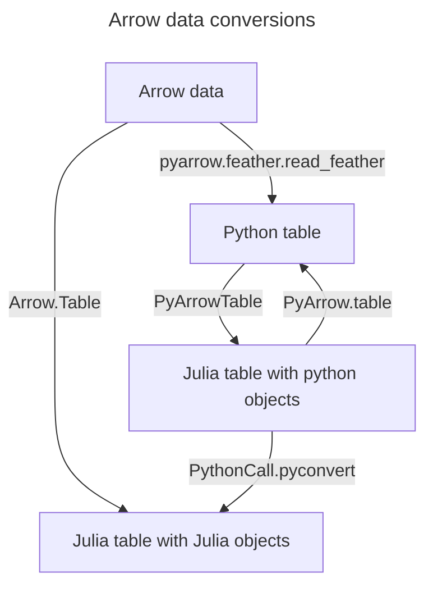

# PyArrow

[](https://github.com/ericphanson/PyArrow.jl/actions/workflows/CI.yml)
[](https://codecov.io/gh/ericphanson/PyArrow.jl)

## Installation

This package uses [`PythonCall`](https://cjdoris.github.io/PythonCall.jl) to make
[pyarrow](https://arrow.apache.org/docs/python/index.html) available from within Julia. Unsurprisingly,
pyarrow and its dependencies need to be installed in order for this to work
and PyArrow.jl will attempt to install when the package is built: this should happen
more or less automatically via [`CondaPkg`](https://github.com/cjdoris/CondaPkg.jl).
You can configure various options via `CondaPkg`.

See [Arrow.jl](https://github.com/apache/arrow-julia) for a pure-Julia alternative. PyArrow.jl can be useful for testing cross-language interoperability for Arrow.jl-powered serialization.

## Alternatives

[Arrow.jl](https://github.com/apache/arrow-julia) provides a Julia-native implementation of reading and writing the Arrow spec, and in most cases PyArrow.jl should only be used if Arrow.jl cannot be for some reason.

PyArrow.jl was primarily written to make it easier to test Julia packages (like Arrow.jl) against pyarrow by providing a convenient wrapper. It can also be used to read/write arrow (and parquet) files from Julia and interop with python, but this package is immature compared to Arrow.jl, and unfortunately marshalling types like datetimes between Julia and Python is not always easy.

Even if you are using PythonCall.jl already and are getting an Arrow-format table via Python code (e.g. Snowflake connector), if you want to use it from Julia, it may be better to use Arrow.jl. After all, Arrow is a great IPC format. For example:

```julia-repl
# Simulate obtaining a pyarrow table in python; here we just read it off disk and write it to a buffer:
julia> feather = pyimport("pyarrow.feather");

julia> table = feather.read_table(joinpath(pkgdir(PyArrow, "test", "test_tables"), "datetimes.arrow"))
Python:
pyarrow.Table
ID: string
LAST_UPDATED_AT: timestamp[ns, tz=UTC]
BIRTH_LOCAL_TIME: time64[us]
BIRTH_UTC_OFFSET: string
DEATH_LOCAL_DATE: date32[day]
DEATH_LOCAL_TIME: time64[us]
----
ID: [["aae5129e-dc81-441b-be91-9b1c97fbc26f","2fd56154-ec62-4d1d-a4a8-1b7eb5a9e908","8a01632f-bffb-46fb-b4cc-cd2bb0db5a4d","47bc4ff1-10f7-4803…
LAST_UPDATED_AT: [[2024-01-03 22:05:33.470000000Z,2024-01-03 22:05:33.470000000Z,2024-01-03 22:05:33.470000000Z,2024-01-03 22:05:33.470000000Z…
BIRTH_LOCAL_TIME: [[21:34:15.000000,10:34:58.000000,15:44:06.000000,07:36:39.000000,17:19:06.000000,14:33:00.000000,09:00:50.000000,05:35:19.0…
BIRTH_UTC_OFFSET: [[null,null,null,null,null,null,null,null,null,null]]
DEATH_LOCAL_DATE: [[null,null,null,null,null,null,null,null,null,null]]
DEATH_LOCAL_TIME: [[null,null,null,null,null,null,null,null,null,null]]

julia> io = IOBuffer()
IOBuffer(data=UInt8[...], readable=true, writable=true, seekable=true, append=false, size=0, maxsize=Inf, ptr=1, mark=-1)

julia> feather.write_feather(table, Py(io))
Python: None

# now `io` contains arrow data, which we can read into Julia objects using Arrow.jl:
julia> jl = Arrow.Table(seekstart(io))
Arrow.Table with 10 rows, 6 columns, and schema:
 :ID                Union{Missing, String}
 :LAST_UPDATED_AT   Union{Missing, ZonedDateTime}
 :BIRTH_LOCAL_TIME  Union{Missing, Time}
 :BIRTH_UTC_OFFSET  Union{Missing, String}
 :DEATH_LOCAL_DATE  Union{Missing, Arrow.Date{Arrow.Flatbuf.DateUnit.DAY, Int32}}
 :DEATH_LOCAL_TIME  Union{Missing, Time}
```

## Usage

In the same philosophy as PythonCall, this allows for the transparent use of
pyarrow from within Julia.
The major things the package does are wrap the installation of pyarrow in the
package installation, export `pyarrow`, and re-export PythonCall.
After that, it's just a Python package accessible via `using PyArrow` in
Julia. The usual conversion rules and behaviors from PythonCall apply.
The [tests](test/runtests.jl) test a few conversion gotchas.

PyArrow also supplies two helper functions:

- `PyArrow.table`, to convert Tables.jl-compatible tables to pyarrow's in-memory format
- `PyArrowTable`, to wrap pyarrow tables in a Tables.jl-compatible interface

These are zero-copy when possible, but it is not guaranteed. See the [tests](./test/runtests.jl) for some cases of what works and what doesn't work.

The following diagram shows how `PyArrow.table` and `PyArrowTable` fit in:


Notes:

* For comparison, Arrow.jl's `Table` is included as `Arrow.Table` in the above diagram.
* `PythonCall.pyconvert` needs to be called on elements of the table, not the entire table (see the `PyArrowTable` docstring for an example).
* `PyArrow.table` can also be used on a "Julia table with Julia objects", but on the python side those objects may appear as wrapped in `juliacall.AnyValue`'s and such

## Examples

Note: see the tests for some more examples, especially with more Julia interop.

Here we translate some of the [Getting Started](https://arrow.apache.org/docs/python/getstarted.html) pyarrow docs.

First, constructing a table with a list-of-lists:

```julia
using PyArrow
import PyArrow: pyarrow as pa

days = pa.array([1, 12, 17, 23, 28], type=pa.int8())
months = pa.array([1, 3, 5, 7, 1], type=pa.int8())
years = pa.array([1990, 2000, 1995, 2000, 1995], type=pa.int16())
birthdays_table = pa.table(pylist([days, months, years]),
                           names=pylist(["days", "months", "years"]))
```

This yields:

```julia-repl
julia> birthdays_table
Python:
pyarrow.Table
days: int8
months: int8
years: int16
----
days: [[1,12,17,23,28]]
months: [[1,3,5,7,1]]
years: [[1990,2000,1995,2000,1995]]
```


We can also write this as a Tables.jl-compatible table, then use `PyArrow.table` to convert it:
```julia
jl_table = (; days = Int8[1, 12, 17, 23, 28],
              months = Int8[1, 3, 5, 7, 1],
              years = Int16[1990, 2000, 1995, 2000, 1995])

birthdays_table = PyArrow.table(jl_table)
```

```julia-repl
Python:
pyarrow.Table
days: int8
months: int8
years: int16
----
days: [[1,12,17,23,28]]
months: [[1,3,5,7,1]]
years: [[1990,2000,1995,2000,1995]]
```

Given such a pyarrow table, we can also access it from Julia using a `PyArrowTable`:

```julia
jl_table = PyArrowTable(birthdays_table)

using DataFrames
df = DataFrame(jl_table)
```

which yields

```julia-repl
julia> df = DataFrame(jl_table)
5×3 DataFrame
 Row │ days  months  years
     │ Int8  Int8    Int16
─────┼─────────────────────
   1 │    1       1   1990
   2 │   12       3   2000
   3 │   17       5   1995
   4 │   23       7   2000
   5 │   28       1   1995
```

Note one may want to use `mapcols(v -> pyconvert.(Any, v), df)` to convert the columns and their elements to native-Julia objects. Here, this isn't necessary since all elements are numbers, but for strings it can be helpful:

```julia
jl_table = (; days = Int8[1, 12, 17, 23, 28],
              months = Int8[1, 3, 5, 7, 1],
              years = Int16[1990, 2000, 1995, 2000, 1995],
              str = ["a", "b", "c", "d", missing])
py_table = PyArrow.table(jl_table)

df = DataFrame(PyArrowTable(py_table))
```
which yields

```julia-repl
julia> df
5×4 DataFrame
 Row │ days  months  years  str
     │ Int8  Int8    Int16  Py
─────┼───────────────────────────
   1 │    1       1   1990  a
   2 │   12       3   2000  b
   3 │   17       5   1995  c
   4 │   23       7   2000  d
   5 │   28       1   1995  None
```

Note the element-type of the column `str` is `Py`. In particular:

```julia-repl
julia> df[1, :str]
Python: 'a'

julia> df[1, :str] == "a"
false
```

However, we can do
```julia
df_jl = mapcols(v -> pyconvert.(Any, v), df)
```

which yields

```julia-repl
julia> df_jl = mapcols(v -> pyconvert.(Any, v), df)
5×4 DataFrame
 Row │ days   months  years  str
     │ Int64  Int64   Int64  Union…
─────┼──────────────────────────────
   1 │     1       1   1990  a
   2 │    12       3   2000  b
   3 │    17       5   1995  c
   4 │    23       7   2000  d
   5 │    28       1   1995

```

We can also write it in parquet format:

```julia
const pq = pyimport("pyarrow.parquet")
pq.write_table(birthdays_table, "birthdays.parquet")
reloaded_birthdays = pq.read_table("birthdays.parquet")
```

Datasets:

```julia
const ds = pyimport("pyarrow.dataset")
ds.write_dataset(birthdays_table, "savedir", format="parquet",
                 partitioning=ds.partitioning(
                    pa.schema([birthdays_table.schema.field("years")])
                ), existing_data_behavior=pystr("overwrite_or_ignore"))
birthdays_dataset = ds.dataset("savedir", format="parquet", partitioning=pylist(["years"]))
birthdays_dataset.files
```

yields:

```julia-repl
julia> birthdays_dataset.files
Python: ['savedir/1990/part-0.parquet', 'savedir/1995/part-0.parquet', 'savedir/2000/part-0.parquet']
```

Batches:

```julia
data = (; f0 = @py([1, 2, 3, 4]),
        f1 = @py(["foo", "bar", "baz", nothing]),
        f2 = @py([true, nothing, false, true]))

batch = pa.RecordBatch.from_arrays(pylist(data), @py(["f0", "f1", "f2"]))
table = pa.Table.from_batches(pylist([batch for _ in 1:5]))
jl_table = PyArrowTable(table)
```

These used `ChainedVectors` to transparently represent the chunked columns:

```julia-repl
julia> Tables.getcolumn(jl_table, 1)
20-element SentinelArrays.ChainedVector{Int64, PyArray{Int64, 1, false, true, Int64}}:
 1
 ⋮
 4

julia> DataFrame(jl_table)
20×3 DataFrame
 Row │ f0     f1    f2
     │ Int64  Py    Py
─────┼────────────────────
   1 │     1  foo   True
   2 │     2  bar   None
   3 │     3  baz   False
  ⋮  │   ⋮     ⋮      ⋮
  19 │     3  baz   False
  20 │     4  None  True
           15 rows omitted
```
